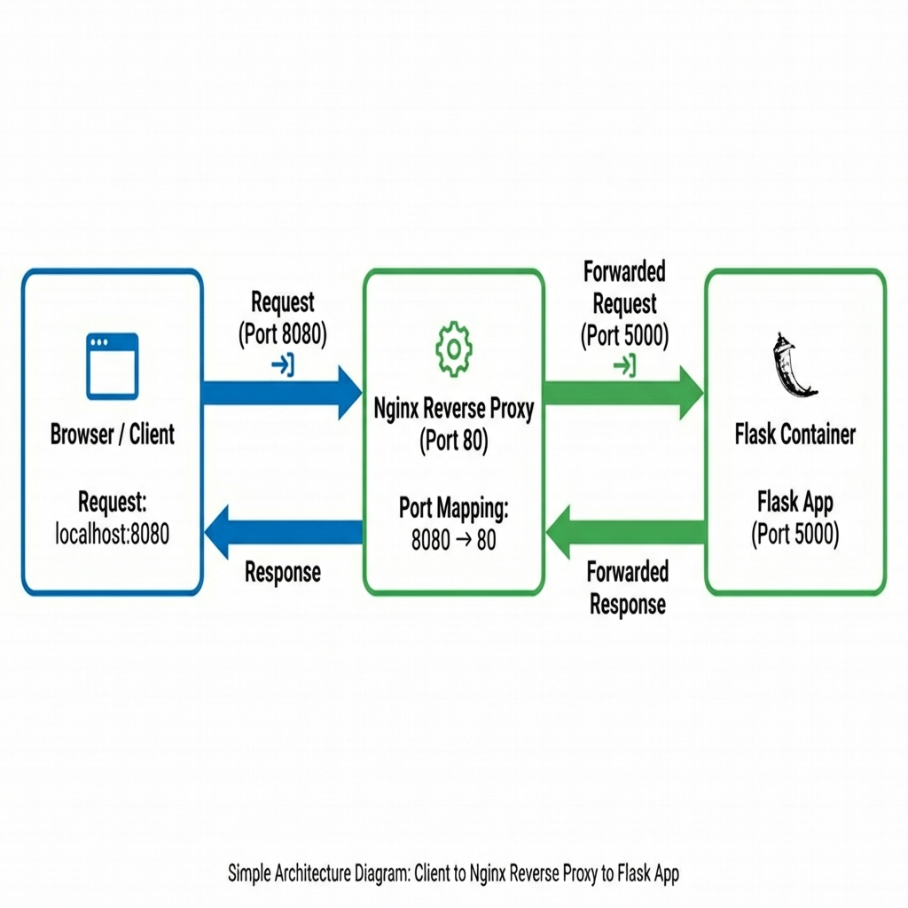
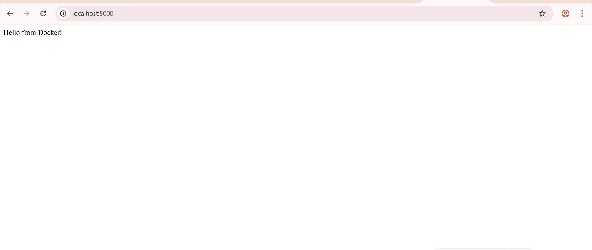

#  Part: Nginx Reverse Proxy


In this part of the lab, we implemented an Nginx reverse proxy to route traffic to the backend Flask application.

##  Architecture

The setup consists of two containers communicating via Docker's network:

1. **Nginx Proxy** (Public facing, Port 8080)
2. **Flask Application** (Backend, Port 5000)



##  Nginx Configuration

### nginx.conf

Updated configuration for Linux/WSL compatibility to handle container-to-container communication.

```nginx
events {}

http {
    server {
        listen 80;

        resolver 127.0.0.11 valid=30s;

        location / {
            # Route traffic to the Flask container
            # Using standard Docker gateway IP for Linux/WSL
            proxy_pass http://172.17.0.1:5000;
            proxy_set_header Host $host;
            proxy_set_header X-Real-IP $remote_addr;
        }
    }
}
```

### Dockerfile

```dockerfile
FROM nginx:alpine
COPY nginx.conf /etc/nginx/nginx.conf
```

##  Running the Proxy

```bash
cd nginx-proxy
docker build -t nginx-proxy .
docker run -d -p 8080:80 nginx-proxy
```

**Build Output:**



## ✅ Verification


