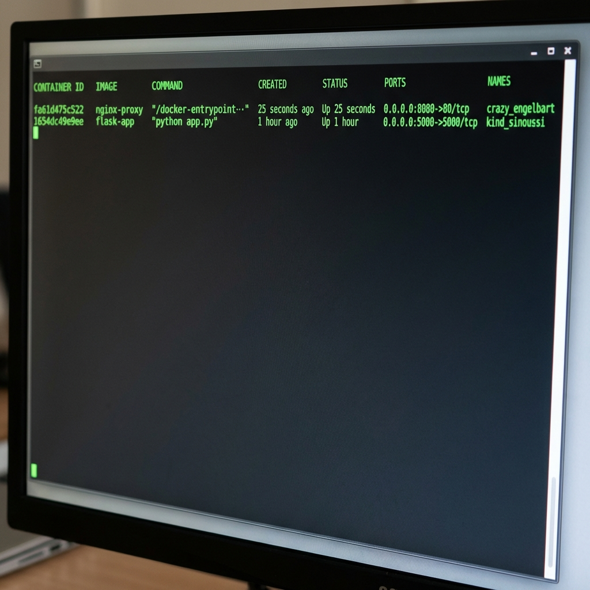

# Docker Lab: Flask Application in a Container


## 📋 Overview

This project demonstrates how to containerize a simple Flask web application using Docker. The application runs in an isolated container environment and can be easily deployed anywhere Docker is supported.

## 🚀 Features

- **Lightweight Python Flask Application** - Simple web server returning "Hello from Docker!"
- **Docker Containerization** - Application packaged with all dependencies
- **Port Mapping** - Accessible on localhost:5000
- **Optimized Image** - Uses `python:3.9-slim` for minimal image size

## 📁 Project Structure

```
docker-lab/
├── app.py              # Flask application
├── Dockerfile          # Docker build instructions
├── .dockerignore       # Files to exclude from Docker image
├── image/              # Screenshots and documentation images
│   ├── image.png
│   
│ 
└── README.md           # This file
```
)

##  Installation & Setup

### 1. Clone the Repository

```bash
git clone https://github.com/valensniyonkuru/docker-lab.git
cd docker-lab
```

### 2. Build the Docker Image

```bash
docker build -t flask-app .
```

**Build Output:**


### 3. Run the Container

```bash
docker run -d -p 5000:5000 flask-app
```


### 4. Access the Application

Open your browser and navigate to:

```
http://localhost:5000
```

**Application Output:**


## 📝 File Descriptions

### app.py

```python
from flask import Flask

app = Flask(__name__)

@app.route('/')
def home():
    return 'Hello from Docker!'

if __name__ == '__main__':
    app.run(host='0.0.0.0', port=5000)
```

### Dockerfile

```dockerfile
FROM python:3.9-slim
WORKDIR /app
COPY . .
RUN pip install flask
EXPOSE 5000
CMD ["python", "app.py"]
```

## 🎯 Docker Commands Reference

### View Running Containers

```bash
docker ps
```

### View All Containers (including stopped)

```bash
docker ps -a
```

### View Container Logs

```bash
docker logs <container-id>
```

### Stop the Container

```bash
docker stop <container-id>
```

### Remove the Container

```bash
docker rm <container-id>
```

### View Docker Images

```bash
docker images
```

### Remove the Image

```bash
docker rmi flask-app
```

## 🔧 Troubleshooting

**Port already in use?**

```bash
# Use a different port
docker run -d -p 8080:5000 flask-app
# Access at http://localhost:8080
```

**Container not starting?**

```bash
# Check container logs
docker logs <container-id>
```


## 🎓 Key Concepts

- **Base Image**: `python:3.9-slim` - A minimal Python image
- **Working Directory**: `/app` - Where the application code lives
- **Port Exposure**: `5000` - Application port
- **Detached Mode**: `-d` flag runs container in background
- **Port Mapping**: `-p 5000:5000` maps host port to container port


<<<<<<< HEAD
=======
## 📄 License

This project is open source and available for educational purposes.

---

---

# 🔄 Part 2: Nginx Reverse Proxy


In this second part of the lab, we implemented an Nginx reverse proxy to route traffic to the backend Flask application.

## 🏗️ Architecture

The setup consists of two containers communicating via Docker's network:

1. **Nginx Proxy** (Public facing, Port 8080)
2. **Flask Application** (Backend, Port 5000)


## 📂 Nginx Configuration

### nginx.conf

Updated configuration for Linux/WSL compatibility to handle container-to-container communication.

```nginx
events {}

http {
    server {
        listen 80;

        resolver 127.0.0.11 valid=30s;

        location / {
            # Route traffic to the Flask container
            # Using standard Docker gateway IP for Linux/WSL
            proxy_pass http://172.17.0.1:5000;
            proxy_set_header Host $host;
            proxy_set_header X-Real-IP $remote_addr;
        }
    }
}
```

### Dockerfile

```dockerfile
FROM nginx:alpine
COPY nginx.conf /etc/nginx/nginx.conf
```

## 🚀 Running the Proxy

```bash
cd nginx-proxy
docker build -t nginx-proxy .
docker run -d -p 8080:80 nginx-proxy
```

**Container Status:**



## ✅ Verification

With both containers running, accessing the proxy redirects to the Flask app:

```bash
curl http://localhost:8080
# Output: Hello from Docker!
```

**⭐ If you found this helpful, please give it a star!**
>>>>>>> 5259139 (Added Nginx reverse proxy implementation and documentation)
